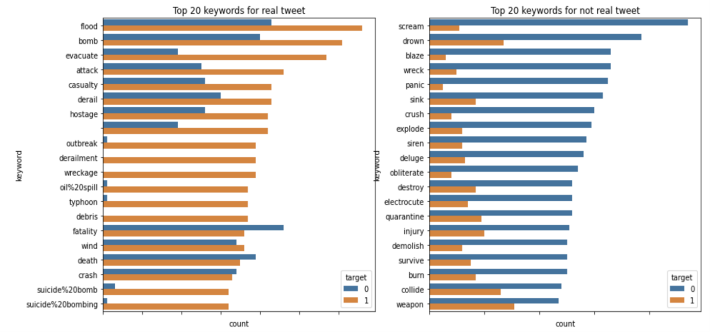
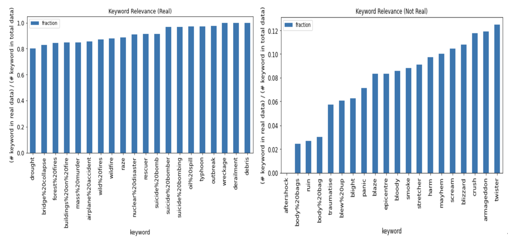
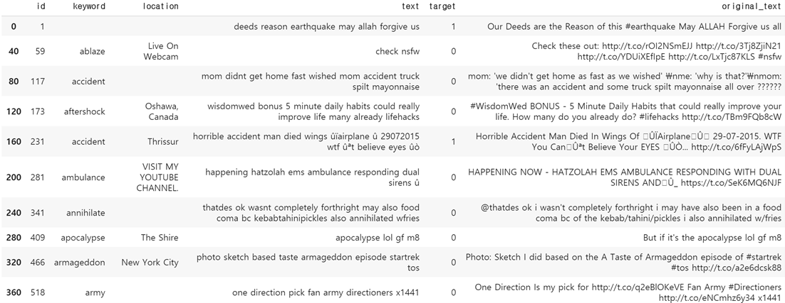
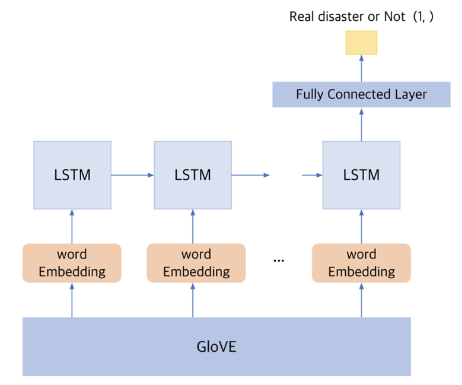
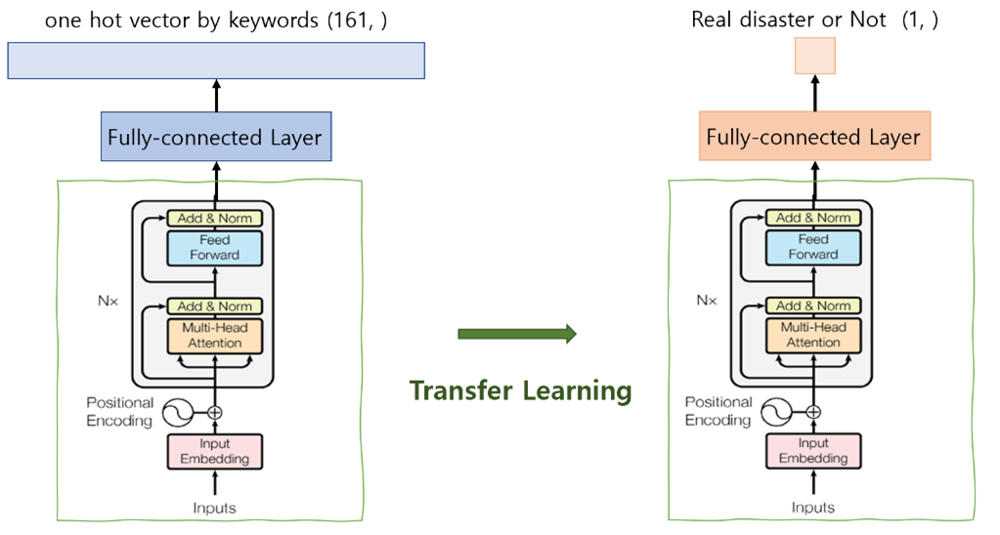
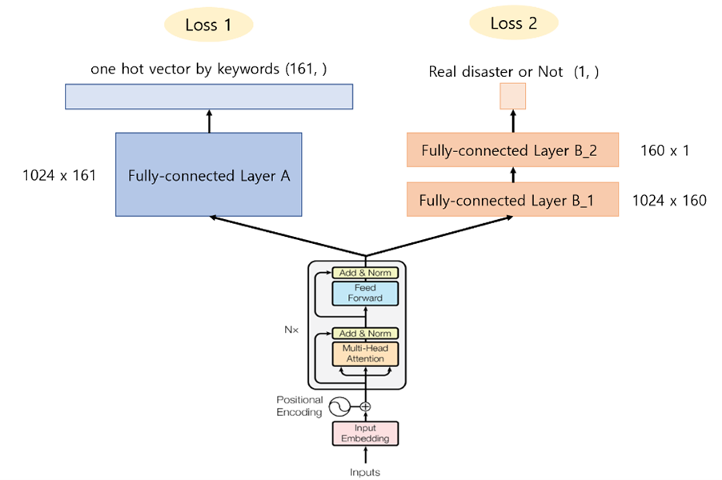

### Problem Description

Kaggle "Real or Not? NLP with Disaster Twets" aims to create a model that can detect tweets about crisis situations that are posted in real time.

### Data Analysis

##### Preprocess

URL, html, emoji and special characters and meaningless stopwords such as "a" and "the" were removed. Also, we changed the abbreviation that is commonly used on Twitter into the original sentence.

### Model
1. GloVE

   

2. XGBoost

3. BERT
    1. BERT + transfer learning
    
       
       
    2. BERT + joint learning
           
       
